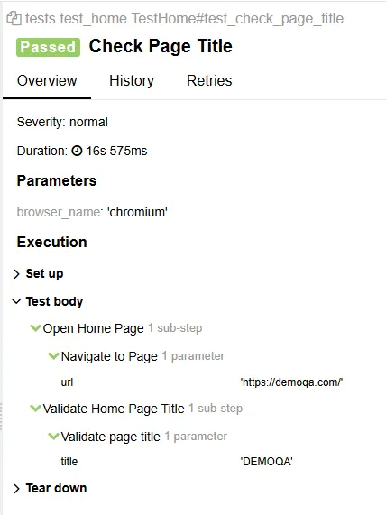

# Playwright Test Template

## Descrição

Este é um projeto que tem como objetivo a criação de um template para projetos de automação de testes com playwright.


## Principais temas abordados:

- Configuração e Instalação do Projeto
   - Configuração do ambiente com arquivos .env
   - Docker Compose para configuração do banco de dados
   - Gerenciamento de configuração através do config.yaml
- Estrutura do Framework de Testes
   - Implementação do Modelo de Objetos de Página
   - Ferramentas e utilitários de teste
   - Gerenciamento e testes do banco de dados
- Qualidade e Padrões do Código
   - Formatação de código com isort e black
   - Ganchos de pré-commit para qualidade do código
   - Tratamento e registro de erros
- Configuração do Navegador
   - Configuração de navegadores web e mobile
   - Configurações personalizadas de navegadores para diferentes ambientes

## Tecnologias Utilizadas

- [Playwright](https://playwright.dev/) - Biblioteca para automação de navegadores.
- [Pytest](https://docs.pytest.org/en/stable/) - Framework de testes para Python.
- [Allure](https://docs.qameta.io/allure/) - Ferramenta de geração de relatórios de testes.


# Ambiente virtual

## Criação do ambiente virtual

```bash
python3 -m venv venv
```

Ativar o ambiente (Linux)

```bash
source venv/bin/activate
```

## Instalar dependências básicas

```bash
pip install -r requirements.txt
```

## Banco de dados
Executar o banco de dados para testes

    docker-compose up -d

Popular o banco de dados de teste

    python init_db.py


## Executar os tests

Script para limpar cache

    python clean_cache.py

Execução dos testes com pytest

    # Executar com Chromium (padrão)
    pytest

    # Executar com Firefox
    pytest --browser firefox

    # Executar com WebKit
    pytest --browser webkit

    # Executar em headless mode
    pytest --headless true


Execução com makefile

    # Executar com Chromium (padrão)
    make test


## Allure Reporting

Execução com allure

    allure serve reports/allure-results

Execução com makefile

    make report

---


# Processo de criação do framework
Documentamos todo o processo de criação e configuração do projeto com objetivo de facilitar o entendimento do mesmo e o porque de cada implementação.


## Configuração base do pytest

### pytest.ini

Arquivo com as configurações básicas do pytest

```bash
[pytest]
addopts = -v -s --headed
testpaths = tests
python_files = test_*.py
python_classes = Test*
python_functions = test
```

### conftest.py

O conftest é um recurso do pytest que cria fixtures que podem ser utilizadas de forma “global”.

Neste caso estamos gerando uma instãncia de uma page do playwright

```python
import pytest
from playwright.sync_api import Page
from typing import Generator

@pytest.fixture(scope="function")
def page(browser) -> Generator[Page, None, None]:
    page = browser.new_page()
    page.set_viewport_size({"width": 1920, "height": 1080})
    yield page
    page.close()
```

### clean_cache.py

Arquivo para limpeza das pastas de cache geradas pelo pytest

```python
import os
import shutil

def remove_cache_dirs(root_dir="."):
    for root, dirs, files in os.walk(root_dir):
        for dir_name in dirs:
            if dir_name == "__pycache__":
                cache_path = os.path.join(root, dir_name)
                shutil.rmtree(cache_path)
                print(f"Removed: {cache_path}")

def remove_pytest_cache_dirs(root_dir="."):
    for root, dirs, files in os.walk(root_dir):
        for dir_name in dirs:
            if dir_name == ".pytest_cache":
                cache_path = os.path.join(root, dir_name)
                shutil.rmtree(cache_path)
                print(f"Removed: {cache_path}")

if __name__ == "__main__":
    remove_cache_dirs()
    remove_pytest_cache_dirs()
    print("Cache directories removed!")

```

### Makefile

Arquivo para facilitar a execução de comandos (linux)

```makefile
clean:
	python clean_cache.py

test: clean
	pytest

```

# Arquivos de pages

## page_objects/base_page.py

Iniciaremos cliando uma classe BasePage que servira como ponto de partira para extensão de outras classes, nela adicionamos métodos para ações genéricas nas paginas.

```python
from playwright.sync_api import Page

class BasePage:
    def __init__(self, page: Page):
        self.page = page

    def navigate_to(self, url: str):
        self.page.goto(url)

    def get_element(self, selector: str):
        return self.page.locator(selector)

    def get_page_title(self) -> str:
        return self.page.title()

    def click_element(self, selector: str):
        self.get_element(selector).click()

    def fill_text(self, selector: str, text: str):
        self.get_element(selector).fill(text)

    def get_text(self, selector: str) -> str:
        return self.get_element(selector).text_content()

    def is_visible(self, selector: str) -> bool:
        return self.get_element(selector).is_visible()

    def wait_for_element(self, selector: str, timeout: int = 5000):
        self.page.wait_for_selector(selector, timeout=timeout)
```

## page_objects/home_page.py

Este arquivos referencia a página home de um site/aplicação. Como podemos ver estamos apenas extendendo a clase BasePage até o momento, ou seja, a HomePage tem acessos aos métodos da BasePage. No futuro a HomePage deve receber métodos refentes ao seu próprio contexto.

```python
from .base_page import BasePage

class HomePage(BasePage):
    def __init__(self, page):
        super().__init__(page)

```

# Arquivo de teste

## tests/test_home.py

Aqui temos nosso primeiro exemplo de teste onde utilizamos uma fixture **home_page** para instanciar a classe **HomePage,** e um teste **test_check_page_title** onde navegamos até uma URL e validamos o title da página carregada.

```python
import pytest
from page_objects.home_page import HomePage

class TestLogin:
    @pytest.fixture
    def home_page(self, page):
        return HomePage(page)

    def test_check_page_title(self, home_page):
        home_page.navigate_to("https://demoqa.com/")
        title = home_page.get_page_title()
        assert title == "DEMOQA"

```

## Executando os testes

O comando pytest pode irá executar os tests.

```python
pytest
```


Podemos também utilizar o Makefile que configuramos para remover o cache antes de executar os tests

```python
make test
```


# Relatório de testes

O relatório de testes nativo do pytest é mostrado no terminal com visto anteriormente, porém podemos utilizar plugins para gerar relatórios em outros formatos.

### `pytest-html` e `pytest-playwright`

```bash
pip install pytest-html
pip install pytest-playwright
```

Atualizar o **pytest.ini** para utilizar os plugins

```bash
[pytest]
addopts = -v -s --headed --html=reports/test_report.html --self-contained-html --tracing=on --video=on --disable-warnings
testpaths = tests
python_files = test_*.py
python_classes = Test*
python_functions = test_*
```

O report será algo similar a:


É melhor que o terminal porém ainda tem poucos recursos. Uma opção mais completa pode ser o Allure report.

### Allure report

```bash
pip install allure-pytest
```

**pytest.ini**

```bash
[pytest]
addopts = --headed --html=reports/report.html --self-contained-html --alluredir=reports/allure-results --clean-alluredir
testpaths = tests
python_files = test_*.py
python_classes = Test*
python_functions = test_*
```

Para abrir o report execute o comando:

```bash
allure serve reports/allure-results
```


## Execução paralela de testes

Para executar tests em paralelo podemos utilizar o plugin **pytest-xdist**

```bash
pip install pytest-xdist
```

Agora você pode usar a opção `-n` para executar os testes em paralelo. Por exemplo:

```bash
[pytest]
addopts = --headed -n 2 --html=reports/report.html --self-contained-html --alluredir=reports/allure-results --clean-alluredir
testpaths = tests
python_files = test_*.py
python_classes = Test*
python_functions = test_*
```

O -n 2 informa que utilizaremos dois browsers para execução.

Para teste vamos duplicar o teste da home para ver o resultado

```python
import pytest
from page_objects.home_page import HomePage

class TestHome:
    @pytest.fixture
    def home_page(self, page):
        return HomePage(page)

    def test_check_page_title(self, home_page):
        home_page.navigate_to("https://demoqa.com/")
        title = home_page.get_page_title()
        assert title == "DEMOQA"

    def test_check_page_title_error(self, home_page):
        home_page.navigate_to("https://demoqa.com/")
        title = home_page.get_page_title()
        assert title == "DEMOQ"
```

Ao executar observe que dois browsers serão abertos, um para cada teste.

## Exibição de erros no Allure report

Ao executar o teste e obter uma falha temos o report similar a este aqui:


Temos a exibição do `AssertionError` algumas informações padrão do framework, **Setup, Teardown** e só. Isso ocorre por conta que para a integração do pytest, playwright e Allure precisamos “montar” o report para que exibida as informações que necessitamos, inclusive para exibir screenshots do momento do erro.

### Contruindo um report

Vamos utilizar dos recursos do Allure para construir um report mais adequado: https://allurereport.org/docs/pytest/

**@allure.title**

Você pode informar ao Allure qual o título a ser exibido pelo teste

```python
import pytest
import allure
from page_objects.home_page import HomePage

class TestHome:
    @pytest.fixture
    def home_page(self, page):
        return HomePage(page)

    @allure.title('Check Page Title')
    def test_check_page_title(self, home_page):
        home_page.navigate_to("https://demoqa.com/")
        title = home_page.get_page_title()
        assert title == "DEMOQA"

    @allure.title('Check Page Error')
    def test_check_page_title2(self, home_page):
        home_page.navigate_to("https://demoqa.com/")
        title = home_page.get_page_title()
        assert title == "DEMOQ"

```


**with allure.step("Step 1") - Context steps**

Podemos também difinir steps utilizando **with allure.step.** Temos um teste com steps e outro sem.

```python
import pytest
import allure
from page_objects.home_page import HomePage

class TestHome:
    @pytest.fixture
    def home_page(self, page):
        return HomePage(page)

    @allure.title('Check Page Title')
    def test_check_page_title(self, home_page):
        home_page.navigate_to("https://demoqa.com/")
        title = home_page.get_page_title()
        assert title == "DEMOQA"

    @allure.title('Check Page Error')
    def test_check_page_title2(self, home_page):
        with allure.step("Navigate to Page"):
          home_page.navigate_to("https://demoqa.com/")
        with allure.step("Get Page Title"):
          title = home_page.get_page_title()
        with allure.step("Assert page title value"):
          assert title == "DEMOQ"

```

Podemos ver que agora o report começou a ficar com mais informações. E um processo um tanto trabalhoso de ter que criar o próprio report, em outras ferramentas como o Robot Framework temos uma certa facilidade ao ter um report nativo.


Podemos melhorar um pouco e ao invez de utilizar direto no teste podemos colocar os steps nos métodos utilizando os decoradores **@allure.step("Step 1")**

Vamos começar atualizando o **page_objects/base_page.py** adicionando steps nos métodos

```python
import allure
from playwright.sync_api import Page

class BasePage:
    def __init__(self, page: Page):
        self.page = page

    @allure.step("Navigate to Page")
    def navigate_to(self, url: str):
        self.page.goto(url)

    @allure.step("Get Element")
    def get_element(self, selector: str):
        return self.page.locator(selector)

    @allure.step("Get Page Title")
    def get_page_title(self) -> str:
        return self.page.title()

    @allure.step("Click Element")
    def click_element(self, selector: str):
        self.get_element(selector).click()

    @allure.step("Fill Text")
    def fill_text(self, selector: str, text: str):
        self.get_element(selector).fill(text)

    @allure.step("Get Element")
    def get_text(self, selector: str) -> str:
        return self.get_element(selector).text_content()

    @allure.step("Is Visible")
    def is_visible(self, selector: str) -> bool:
        return self.get_element(selector).is_visible()

    @allure.step("Wait For Element")
    def wait_for_element(self, selector: str, timeout: int = 5000):
        self.page.wait_for_selector(selector, timeout=timeout)

```

Vamos atualizar o nosso arquivo **home_page.py** e adicionar um método para validar o title da página e assim utilizar no lugar do assert

```python
import allure
from .base_page import BasePage
from playwright.sync_api import Page, expect

class HomePage(BasePage):
    def __init__(self, page: Page):
        super().__init__(page)
        self.page = page

    @allure.step("Validate page title")
    def has_title(self, title):
        expect(self.page).to_have_title(title)

```

Com isso atualizamos nossos testes e podemos remover os steps de contexto e utilizar o novo método para validar o title. **tests/test_home.py**

```python
import pytest
import allure
from page_objects.home_page import HomePage
from utils.asserts import BaseAsserts

class TestHome:
    @pytest.fixture
    def home_page(self, page) -> HomePage:
        return HomePage(page)

    @allure.title('Check Page Title')
    def test_check_page_title(self, home_page: HomePage):
        home_page.navigate_to("https://demoqa.com/")
        home_page.has_title("DEMOQA")

    @allure.title('Check Page Error')
    def test_check_page_title2(self, home_page: HomePage):
        home_page.navigate_to("https://demoqa.com/")
        home_page.has_title("DEMOQ")

```

### Adicionando captura de screenshots

O teste falhou, temos o registro do erro, os steps dos testes mas não temos o screenshot da página. Vamos agora criar um solução para capturar screenshots em caso de falhas.

Primeiro vamos criar o método que salve um screenshot **utils/screenshot.py.**

O que fazemos aqui é criar uma pasta para salvar os screenshots caso não exista, criar um nome único para o arquivo utilizando timestemp e fazer o registro do mesmo no allure.

```python
"""
Screenshot Utility for Error Capturing and Reporting

This module provides a function to capture screenshots during test execution and attach them to Allure reports.

Functions:
    save_screenshot(self, func_name, type='PNG', folder="screenshots"):
        Captures a screenshot of the current page, saves it to a specified folder, and logs it in Allure.

Args:
    self: Object with a `page` attribute that supports a `screenshot` method.
    func_name (str): The name of the function triggering the screenshot.
    type (str): The type of attachment for Allure (default: 'PNG').
    folder (str): The directory where screenshots will be saved (default: "screenshots").

Behavior:
    - Creates the screenshots directory if it does not exist.
    - Appends a timestamp to the screenshot file name for uniqueness.
    - Attaches the screenshot as a binary file to Allure reports.
"""

import os
import allure
from datetime import datetime
from .logger import log_allure

@allure.step("Save Screenshot")
def save_screenshot(self, func_name, type='PNG', folder="screenshots"):
    """
    Captures a screenshot of the current page, saves it, and attaches it to an Allure report.

    Args:
        self: Object containing the `page` attribute for screenshot capture.
        func_name (str): Name of the function where the screenshot is triggered.
        type (str): Attachment type for Allure (default is 'PNG').
        folder (str): Directory to save the screenshots (default is 'screenshots').

    Process:
        - Generates a file name with a timestamp.
        - Ensures the directory for saving screenshots exists.
        - Saves the screenshot in the specified folder.
        - Attaches the screenshot to Allure with the specified type.
    """
    timestamp = datetime.now().strftime("%Y%m%d_%H%M%S")
    screenshot_path = f"{folder}/{func_name}_{timestamp}.png"

    # Ensure the folder exists
    os.makedirs(folder, exist_ok=True)

    # Capture and save the screenshot
    self.page.screenshot(path=screenshot_path)

    # Attach the screenshot to the Allure report
    with open(screenshot_path, 'rb') as f:
        log_allure(
            message=f.read(),
            name=f"{func_name}_screenshot_{timestamp}",
            type=type
        )

```

Poderíamos utilizar este método diretamente no código sem problemas algum, porém teríamos que dizer onde queremos salvar o screenshot. Vamos criar uma estrutura que utilize este método e salve o screenshot em casos de falhas de forma automática.

Vamos criar um decorator que será um “**wrapper”** que vai receber a função decorada e tratar o erro dela gerando um log e salvando o screenshot.

Vamos começar criando uma classe para exibição de logs:

**utils/logger.py**

O que temos aqui é a extensão da classe logging onde criamos nosso próprio retorno de log e podemos configurar conforme nossa necessidade.

```python
"""
Logging Utility for Message Tracking and Reporting

This module provides utility functions for logging messages to both the console and Allure reports.

Functions:
    log_allure(message, name='Log info', type='TEXT'):
        Logs a message to Allure as an attachment with the specified type and name.

    log_error(message):
        Logs an error-level message to the console and Allure.

    log_info(message):
        Logs an info-level message to the console.

Behavior:
    - Uses Python's logging module for console output.
    - Logs messages in Allure for enhanced report tracking.

Logging Configuration:
    - Default logging level: INFO
    - Format: '[LEVEL] message'
    - Date format: 'dd-mm-yyyy HH:MM:SS'
"""

import logging
import allure

# Configure logging
if not logging.getLogger().hasHandlers():
    logging.basicConfig(
        level=logging.INFO,
        format='[%(levelname)s] %(message)s',
        datefmt='%d-%m-%Y %H:%M:%S',
    )

@allure.step("Log - Allure")
def log_allure(message, name='Log info', type='TEXT'):
    """
    Logs a message to Allure as an attachment.

    Args:
        message (str): The message to be logged.
        name (str): The name of the attachment in the Allure report. Default is 'Log info'.
        type (str): The type of attachment (e.g., 'TEXT', 'HTML', etc.). Default is 'TEXT'.
    """
    allure.attach(
        message,
        name,
        attachment_type=allure.attachment_type[type]
    )

def log_error(message):
    """
    Logs an error message.

    Args:
        message (str): The error message to log.
    """
    logging.error(message)
    log_allure(message, 'Error Log')

def log_info(message):
    """
    Logs an informational message.

    Args:
        message (str): The info message to log.
    """
    logging.info(message)

```

Agora criamos nosso decorator para capturar falhas.

**utils/decorators.**

Aqui utilizamos tanto o **log_error** quanto o **save_screenshot.** Aqui nós recebemos uma função, executamos e tratamos o erro retornando log e salvando o screenshot da tela.

```python
from functools import wraps
from .screenshot import save_screenshot

def capture_on_failure(func):
    """
    A decorator function to capture and log exceptions raised during the execution
    of a wrapped function. Additionally, it saves a screenshot for debugging purposes.

    Args:
        func (callable): The function to be wrapped.

    Returns:
        callable: A wrapped function with enhanced error-handling capabilities.

    Behavior:
        - Executes the decorated function.
        - If an exception occurs:
            1. Logs the error with the function name and exception details.
            2. Saves a screenshot associated with the failure.
            3. Reraises the original exception.

    Example:
        @capture_on_failure
        def example_function(self):
            # Function logic here
    """
    @wraps(func)
    def wrapper(self, *args, **kwargs):
        try:
            return func(self, *args, **kwargs)
        except Exception as e:
            func_name = func.__name__
            save_screenshot(self, func_name)
            raise e
    return wrapper

```

Agora podemos utilizar o decorator **@capture_on_failure** nos métodos do nosso framework e tratar os erros de forma automática.

Como exemplo vamos decorar o método has_title:

**page_objects/home_page.py**

```python
import allure
from .base_page import BasePage
from playwright.sync_api import Page, expect
from utils.decorators import capture_on_failure

class HomePage(BasePage):
    def __init__(self, page: Page):
        super().__init__(page)
        self.page = page

    @capture_on_failure
    @allure.step("Validate page title")
    def has_title(self, title):
        expect(self.page).to_have_title(title)

```

Ao executar os testes temos o log e o screenshot


Faremos alguns ajustes somente para deixar mais claro o conceito de estruturar a automação com pages.

No arquivo **page_objects/base_page.py** podemos adicionar a validação do title da página.

```python
import allure
from playwright.sync_api import Page, expect
from utils.decorators import capture_on_failure

class BasePage:
    def __init__(self, page: Page):
        self.page = page

    @capture_on_failure
    @allure.step("Navigate to Page")
    def navigate_to(self, url: str):
        self.page.goto(url)

    @capture_on_failure
    @allure.step("Get Element")
    def get_element(self, selector: str):
        return self.page.locator(selector)

    @capture_on_failure
    @allure.step("Get Page Title")
    def get_page_title(self) -> str:
        return self.page.title()

    @capture_on_failure
    @allure.step("Click Element")
    def click_element(self, selector: str):
        self.get_element(selector).click()

    @capture_on_failure
    @allure.step("Fill Text")
    def fill_text(self, selector: str, text: str):
        self.get_element(selector).fill(text)

    @capture_on_failure
    @allure.step("Get Element")
    def get_text(self, selector: str) -> str:
        return self.get_element(selector).text_content()

    @capture_on_failure
    @allure.step("Is Visible")
    def is_visible(self, selector: str) -> bool:
        return self.get_element(selector).is_visible()

    @capture_on_failure
    @allure.step("Wait For Element")
    def wait_for_element(self, selector: str, timeout: int = 5000):
        self.page.wait_for_selector(selector, timeout=timeout)

    @capture_on_failure
    @allure.step("Validate page title")
    def check_if_page_has_title(self, title):
        expect(self.page).to_have_title(title)
```

Agora podemos alterar o arquivo **page_objects/home_page.py** para utilizar esta validação e também podemos criar algumas variáveis para conter a URL da home e a string do title. Agora tudo que precisamos para a home está no arquivo da home.

Um detalhe importante é que removemos o decorator **@capture_on_failure** das funções da Home, isso porque já utilizamos o mesmo nas funções base, logo seria redundante utilizar novamente, caso crie alguma método na home que não utilize um que já tenha a captura de erros ai sim deve utilizar o decorator.

```python
import allure
from .base_page import BasePage
from playwright.sync_api import Page, expect
from utils.decorators import capture_on_failure

class HomePage(BasePage):
    def __init__(self, page: Page):
        super().__init__(page)
        self.page = page
        self.url = "https://demoqa.com/"
        self.page_title = "DEMOQA"

    @allure.step("Open Home Page")
    def navigate(self):
        self.navigate_to(self.url)

    @allure.step("Validate Home Page Title")
    def has_title(self):
        self.check_if_page_has_title(self.page_title)

```

Por fim o teste somente chama as funções da home e as utiliza

```python
import pytest
import allure
from page_objects.home_page import HomePage

class TestHome:
    @pytest.fixture
    def home_page(self, page) -> HomePage:
        return HomePage(page)

    @allure.title('Check Page Title')
    def test_check_page_title(self, home_page: HomePage):
        home_page.navigate()
        home_page.has_title()
```



Neste momento temos já temos um template funcional do qual pode ser otimizado conforme as necessidades.

- Pages
    - Arquivo com métodos genéricos
        - pages/base_page.py
    - Arquivo dedicado a uma página
        - pages/home_page.py
- Utils
    - Tratamento de erros com log customizável e screenshot automático
        - utils/logger.py
        - utils/screenshot.py
        - utils/decorators.py
- Tests
    - Tests utilizando as pages e deixando mais fácil seu entendimento

---

# Configurando uma base url

No arquivo **pytest.ini** pode adicionar a base url do projeto

```python
base_url = https://demoqa.com/
```

Vamos criar uma fixture no [conftest.py](http://conftest.py/) para acessar a base url

```python
@pytest.fixture(scope="session")
def base_url(request):
    return request.config.getoption("--base-url") or request.config.getini("base_url")
```

Alteramos o **home_page.py** para utilizar a base url

```python
import allure
from .base_page import BasePage
from playwright.sync_api import Page

class HomePage(BasePage):
    def __init__(self, page: Page, base_url):
        super().__init__(page)
        self.page = page
        self.base_url = base_url
        self.page_title = "DEMOQA"

    @allure.step("Open Home Page")
    def navigate(self):
        self.navigate_to(self.base_url)

    @allure.step("Validate Home Page Title")
    def has_title(self):
        self.check_if_page_has_title(self.page_title)

```

E por fim nosso teste pode ser atualizado também

```python
import pytest
import allure
from pages.home_page import HomePage

class TestHome:
    @pytest.fixture
    def home_page(self, page, base_url) -> HomePage:
        return HomePage(page, base_url)

    @allure.title('Check Page Title')
    def test_check_page_title(self, home_page: HomePage):
        home_page.navigate()
        home_page.has_title()

```

---

# Variáveis de ambiente

Em muitos projetos precisamos de variáveis de ambiente para conseguir configurar o projeto em distintos ambientes. Criaremos uma estrutura para conseguirmos fazer isso.

Iniciaremos criando um arquivo de configuração padrão para o projeto chamado **config.yaml.**

```python
ENVIRONMENT: "RC"
DEVICE_NAME: "Nexus 5"
SQL_SCRIPTS_FOLDER: "./resources/sql/"
I18N_FOLDER_PATH: "./resources/i18n"

NEW_CONTEXT:
  accept_downloads: True
  locale: None
  user_agent: None

```

Para lermos o arquivo devemos instalar o:

```python
pip install PyYAML
```

E devemos criar um método para ler o arquivo:

**utils/ReadFile.py**

```python
import yaml
import os
import allure
from .logger import log_allure

class ReadFile():
    def __init__(self):
        pass

    @allure.step("Load config from yaml")
    def load_yaml_file(self, config_file: str, override: dict = None):
        """
        Loads a YAML file and allows overriding with values passed per parameter.

        :param config_file: YAML file path
        :param override: Dictionary with values to override
        :return: Dictionary with final settings
        """
        if not os.path.exists(config_file):
            raise FileNotFoundError(f"Config file not found: {config_file}")

        try:
            with open(config_file, 'r') as file:
                config = yaml.safe_load(file)
        except yaml.YAMLError as e:
            raise ValueError(f"Error reading YAML file: {e}")

        if override:
            config.update(override)

        log_allure(f'File content: {config}')

        return config

```

No [conftest.py](http://conftest.py/) vamos criar um fixture para ler este arquivo de configuração e utilizamos também o recurso **pytest_addoption** para conseguir ler dados também pelo terminar, estamos com o objetivo de caso o usuário desejar não utilizar o valor padrão de **ENVIRONMENT** ele pode sobrecrever pelo terminal, o mesmo para **PIPELINE**

```python
CONFIG_YAML_PATH = './config.yaml'

def pytest_addoption(parser):
    parser.addoption("--env", action="store", help="Execution environment: rc, uat")
    parser.addoption("--pipeline", action="store", help="Run tests in pipeline: true, false")

@pytest.fixture(scope="session", autouse=True)
def env(request):

    env_option = request.config.getoption("--env", default=None)
    if env_option:
        log_allure(
            f'Select environment by terminal: ENVIRONMENT {env_option.upper()}')
        return env_option

    read_file = ReadFile()
    config = read_file.load_yaml_file(CONFIG_YAML_PATH)
    log_allure(
        f'Select environment by config file -> {CONFIG_YAML_PATH}: ENVIRONMENT {config["ENVIRONMENT"]}')
    return config["ENVIRONMENT"]
```

O método **env** retorna o valor da variável **ENVIRONMENT** ou o valor passado pelo terminal:

```python
pytest --env uat --pipeline True
```

Agora temos uma forma de informar qual o ambiente que desejamos executar o projeto.

Vamos agora utilizar o dotenv para criarmos uma estrutura com variaveis de ambientes.

**utils/SetDotEnv.py**

Neste script nós estamos configurando as variáveis de ambiente com base na variável **environment,**

Neste caso o dotenv está aguardando que existam arquivos na raiz do projeto que tenham em seu nome o mesmo valor da variável **enviroment** (rc.env, uat.env, dev.env, etc…). O objetivo neste caso é configurar o projeto localmente para acessar vários ambientes, temos também a variável pipeline que configura para os testes rodarem no ambiente da pipeline e então utilizar as variáveis que estivem configuradas no embiente da execução da pipeline.

```python
import os
import allure
from dotenv import dotenv_values, load_dotenv
from .logger import log_allure

class SetDotEnv:
    def __init__(self):
        pass

    @allure.step("Set Project Environment Variables")
    def set_project_environment_variables(
        self,
        pipeline: bool = False,
        environment: str = 'rc'
    ) -> dict:
        """
        Set Environment Project Variables

        This function configures environment variables for the current session. It supports two modes:

        1. Pipeline Mode (`pipeline=True`): Loads variables directly from the OS environment.
        2. File Environment Mode (`pipeline=False`): Loads variables from a `.env` file corresponding to the specified environment name.

        Args:
            pipeline (bool): Flag to determine if variables should be loaded from the OS environment (default: False).
            environment (str): The name of the `.env` file to load (default: 'rc').
            print_variables (bool): Flag to print loaded environment variables to the console (default: False).

        Returns:
            dict: Key-value pairs of the loaded environment variables.

        Raises:
            FileNotFoundError: If the specified `.env` file is not found.
            Exception: For other issues during variable loading.
        """
        try:
            if pipeline:
                variables = dict(os.environ)
                log_allure(f'Run tests on Pipeline: {pipeline}')
            else:
                env_file = f"{environment.lower()}.env"
                if not os.path.exists(env_file):
                    raise FileNotFoundError(f"Environment file '{env_file}' not found.")

                load_dotenv(env_file, override=True)
                log_allure(f'Loaded Environment file: {env_file}')
                variables = dict(os.environ)

            if variables:
                log_allure(F'ENVIRONMENTS VARIABLES SET WITH SUCCESS')
                return variables
            else:
                raise ValueError(f"No environment variables found.")

        except Exception as e:
            raise Exception(f"Error loading environment variables: {e}")
```

Instalar o dotenv

```python
pip install python-dotenv
```

No arquivo [**conftest.py](http://conftest.py)** vamos criar uma fixture para setar as variaveis de ambiente.

```python
@pytest.fixture(scope="module", autouse=True)
def set_environment_variables(request, env):
    """
    Loads environment variables into the project before running tests.
    """

    dot_env = SetDotEnv()
    environment = request.config.getoption("--env", default=None)
    pipeline = request.config.getoption("--pipeline", default=False)

    if environment:
        dot_env.set_project_environment_variables(pipeline, environment)
    else:
        dot_env.set_project_environment_variables(pipeline, env)
```

O que falta agora é criar os arquivos .env na raiz do projeto com os valores de cada ambiente

Exemplo: **rc.env**

```python
DB_NAME="RC"
DB_USER="RC"
DB_PASSWORD="RC"
DB_HOST="RC"
DB_PORT="RC"
URL="RC"
```

Agora podemos executar os tests e se não passarmos o valor de —env no terminal será executado com o valor que estiver no arquivo **config.yaml.** Os método serão executados no setup dos tests.


Uma coisa importante é que as variáveis de ambientes não devem ser expostar nos repositórios do código, logo devemos arquivos os arquivos .env  no .gitignore

```python
venv
env
.pytest_cache
__pycache__
.vscode
allure-results
allure-report
report.html
screenshots
reports/
report.md
results.txt
test-results
logs
rc.env
uat.env
```

Agora nós temos acesso as variáveis de ambiente e podemos utilizar as mesmas para direcionar o nosso projeto. Com isso podemos agora remover a base url que estavamos utilizando pelo [pytestini.py](http://pytestini.py) e utilizar uma para cada ambiente.

[conftest.py](http://conftest.py/)

Atualizamos a **base_url** e adicionamos a **set_environment_variables** como sua dependência

```python
import pytest
import allure
import os
from playwright.sync_api import Page
from typing import Generator
from utils.ReadFile import ReadFile
from utils.logger import log_allure
from utils.SetDotEnv import SetDotEnv

CONFIG_YAML_PATH = './config.yaml'

def pytest_addoption(parser):
    parser.addoption("--env", action="store", help="Execution environment: rc, uat")
    parser.addoption("--pipeline", action="store", help="Run tests in pipeline: true, false")

@pytest.fixture(scope="function")
def page(browser) -> Generator[Page, None, None]:
    page = browser.new_page()
    page.set_viewport_size({"width": 1920, "height": 1080})
    yield page
    page.close()

@pytest.fixture(scope="session", autouse=True)
def env(request):

    env_option = request.config.getoption("--env", default=None)
    if env_option:
        log_allure(
            f'Select environment by terminal: ENVIRONMENT {env_option.upper()}')
        return env_option

    read_file = ReadFile()
    config = read_file.load_yaml_file(CONFIG_YAML_PATH)
    log_allure(
        f'Select environment by config file -> {CONFIG_YAML_PATH}: ENVIRONMENT {config["ENVIRONMENT"]}')
    return config["ENVIRONMENT"]

@pytest.fixture(scope="session", autouse=True)
def set_environment_variables(request, env):
    """
    Loads environment variables into the project before running tests.
    """
    dot_env = SetDotEnv()
    environment = request.config.getoption("--env", default=None)
    pipeline = request.config.getoption("--pipeline", default=False)

    if environment:
        dot_env.set_project_environment_variables(pipeline, environment)
    else:
        dot_env.set_project_environment_variables(pipeline, env)

@pytest.fixture(scope="session", autouse=True)
def base_url(request, set_environment_variables):
    """
    Returns the base URL from environment variables with error handling.
    """
    try:
        base_url = request.config.getoption("--base-url")
        if base_url:
            return base_url

        if 'URL' not in os.environ:
            raise KeyError(
                "URL environment variable is not set. "
                "Please check if set_environment_variables is working correctly "
                "or provide --base-url via command line."
            )

        return os.environ['URL']
    except Exception as e:
        pytest.fail(f"Failed to get base URL: {str(e)}")

```

# Configuração do Browser / Contexto

Seguindo a contrução do framework/template vamos configurar para nosso testes rodarem com configurações predefinidas, queremos rodar testes web e mobile e conseguir de forma simples alterar as configurações de cada um. Vamos começar criando configurações para web e mobile no arquivo **config.yaml.**

**config.yaml**

```python
ENVIRONMENT: "RC"
DEVICE_NAME: "Nexus 5"
SQL_SCRIPTS_FOLDER: "./resources/sql/"
I18N_FOLDER_PATH: "./resources/i18n"

WEB_CONFIG:
  viewport:
    width: 1920
    height: 1080
  accept_downloads: true
  locale: "pt-BR"
  user_agent: "Mozilla/5.0 (Windows NT 10.0; Win64; x64) AppleWebKit/537.36"
  # Adicione qualquer outra configuração suportada pelo Playwright aqui

MOBILE_CONFIG:
  devices:
    - name: "Nexus 5"
      viewport:
        width: 360
        height: 640
      device_scale_factor: 2
      is_mobile: true
      has_touch: true
      user_agent: "Mozilla/5.0 (Linux; Android 6.0; Nexus 5)"
      # Adicione qualquer outra configuração suportada pelo Playwright aqui
```

Agora temos que ler estas configurações para utilizar no projeto. No arquivo [conftest.py](http://conftest.py/) vamos primeiro criar uma função para ler o arquivo yaml e assim centralizar esta ação.

```python
CONFIG_YAML_PATH = './config.yaml'

def get_config() -> dict:
    """Retorna as configurações do arquivo config.yaml"""
    read_file = ReadFile()
    return read_file.load_yaml_file(CONFIG_YAML_PATH)
```

Agora vamos remover a fixture page que tinhamos e no lugar dela criar uma para web e outra para mobile. O arquivo [conftest.py](http://conftest.py) ficará da seguinte forma:

```python
import pytest
import allure
import os
from playwright.sync_api import Page, Browser
from typing import Generator
from utils.ReadFile import ReadFile
from utils.logger import log_allure
from utils.SetDotEnv import SetDotEnv

CONFIG_YAML_PATH = './config.yaml'

def get_config() -> dict:
    """Retorna as configurações do arquivo config.yaml"""
    read_file = ReadFile()
    return read_file.load_yaml_file(CONFIG_YAML_PATH)

def pytest_addoption(parser):
    parser.addoption("--env", action="store", help="Execution environment: rc, uat")
    parser.addoption("--pipeline", action="store", help="Run tests in pipeline: true, false")

@pytest.fixture(scope="session", autouse=True)
def env(request):

    env_option = request.config.getoption("--env", default=None)
    if env_option:
        log_allure(
            f'Select environment by terminal: ENVIRONMENT {env_option.upper()}')
        return env_option

    read_file = ReadFile()
    config = get_config()
    log_allure(
        f'Select environment by config file -> {CONFIG_YAML_PATH}: ENVIRONMENT {config["ENVIRONMENT"]}')
    return config["ENVIRONMENT"]

@pytest.fixture(scope="session", autouse=True)
def set_environment_variables(request, env):
    """
    Loads environment variables into the project before running tests.
    """
    dot_env = SetDotEnv()
    environment = request.config.getoption("--env", default=None)
    pipeline = request.config.getoption("--pipeline", default=False)

    if environment:
        dot_env.set_project_environment_variables(pipeline, environment)
    else:
        dot_env.set_project_environment_variables(pipeline, env)

@pytest.fixture(scope="session", autouse=True)
def base_url(request, set_environment_variables):
    """
    Returns the base URL from environment variables with error handling.
    """
    try:
        base_url = request.config.getoption("--base-url")
        if base_url:
            return base_url

        if 'URL' not in os.environ:
            raise KeyError(
                "URL environment variable is not set. "
                "Please check if set_environment_variables is working correctly "
                "or provide --base-url via command line."
            )

        return os.environ['URL']
    except Exception as e:
        pytest.fail(f"Failed to get base URL: {str(e)}")

@pytest.fixture(scope="function")
def web_page(browser: Browser) -> Generator[Page, None, None]:
    """Creates a new page with web configuration"""
    config = get_config()
    web_config = config.get("WEB_CONFIG", {})

    # Cria o contexto com todas as configurações do WEB_CONFIG
    context = browser.new_context(**web_config)
    page = context.new_page()
    yield page
    context.close()

@pytest.fixture(scope="function")
def mobile_page(browser: Browser, device_name: str = "Nexus 5") -> Generator[Page, None, None]:
    """Creates a new page with mobile configuration"""
    config = get_config()
    mobile_config = config.get("MOBILE_CONFIG", {})

    # Encontra a configuração específica do device
    device_config = next(
        (device for device in mobile_config.get("devices", [])
         if device["name"] == device_name),
        {}
    )

    # Remove o campo 'name' para não causar conflito
    if "name" in device_config:
        del device_config["name"]

    context = browser.new_context(**device_config)
    page = context.new_page()
    yield page
    context.close()

```

Agora podemos atualizar nosso arquivo de teste. Vamos criar um teste para mobile e assim testar nossa nova configuração:

```python
import pytest
import allure
from pages.home_page import HomePage

class TestHome:
    @pytest.fixture
    def web_home_page(self, web_page, base_url) -> HomePage:
        return HomePage(web_page, base_url)

    @pytest.fixture
    def mobile_home_page(self, mobile_page, base_url) -> HomePage:
        return HomePage(mobile_page, base_url)

    @allure.title('Check Page Title - Web')
    def test_check_page_title_web(self, web_home_page: HomePage):
        web_home_page.navigate()
        web_home_page.has_title()

    @allure.title('Check Page Title - Mobile')
    def test_check_page_title_mobile(self, mobile_home_page: HomePage):
        mobile_home_page.navigate()
        mobile_home_page.has_title()

```

Podemos observar que temos uma fixture **web_home_page** e outra **mobile_home_page** e cada teste utiliza uma delas. Ao executar os testes vemos que será aberto um browser para web e outro para mobile seguindo as nossas configurações.

Podemos evoluir um pouco mais criando uma factory para criar as fixtures de web e mobile conforme a config da page que desejar. No [conftest.py](http://conftest.py) adicionar o seguinte método:

```python
def create_page_fixture(page_class):
    """Função auxiliar para criar fixtures de pages"""

    @pytest.fixture
    def web_fixture(web_page, base_url):
        return page_class(web_page, base_url)

    @pytest.fixture
    def mobile_fixture(mobile_page, base_url):
        return page_class(mobile_page, base_url)

    return web_fixture, mobile_fixture


# Criar fixtures para cada page
web_home_page, mobile_home_page = create_page_fixture(HomePage)
```

Criamos uma fábrica de fixture que recebe a classe do page e retorna o fixture dela para web e mobile.

```python
web_home_page, mobile_home_page = create_page_fixture(HomePage)
```

A linha acima a fora do método e serve para instanciar as fixture. Agora os arquivos de teste ficam ainda mais limpos pois podemos remover as fixtures de lá

```python
import allure
from pages.home_page import HomePage

class TestHome:
    @allure.title('Check Page Title - Web')
    def test_check_page_title_web(self, web_home_page: HomePage):
        web_home_page.navigate()
        web_home_page.has_title()

    @allure.title('Check Page Title - Mobile')
    def test_check_page_title_mobile(self, mobile_home_page: HomePage):
        mobile_home_page.navigate()
        mobile_home_page.has_title()
```

Se observarmos a **create_page_fixture** estamos solicitando a **base_url** para as classes, porém pode pode ser desnecessário o base_url para algumas classes, podemos quere que a classe tenha a sua url, isso faz até mais sentido. Vamos modificar a lógica atual deixando a base url somente na home.

Começaremos criando um helper para tratar a url base:

**utils/url_helper.py**

```python
import os
import pytest

def get_base_url():
    """
    Returns the base URL from environment variables with error handling.
    """
    try:
        # Tenta obter do ambiente primeiro
        if 'URL' in os.environ:
            return os.environ['URL']

        # Se não encontrar no ambiente, retorna uma URL padrão ou lança exceção
        raise KeyError("URL environment variable is not set.")
    except Exception as e:
        pytest.fail(f"Failed to get base URL: {str(e)}")
```

Vamos alterar a classe HomePage para utilizar este helper

**pages/home_page.py**

```python
import allure
from playwright.sync_api import Page
from .base_page import BasePage
from utils.url_helper import get_base_url

class HomePage(BasePage):
    def __init__(self, page: Page):
        super().__init__(page)
        self.page = page
        self.url = get_base_url()
        self.page_title = "DEMOQA"

    @allure.step("Open Home Page")
    def navigate(self):
        self.navigate_to(self.url)

    @allure.step("Validate Home Page Title")
    def has_title(self):
        self.check_if_page_has_title(self.page_title)

```

Para exemplificar melhor vamos criar uma classe **LoginHome** onde utilizamos uma url expecífica de login:

**pages/login_page.py**

```python
import allure
from .base_page import BasePage
from playwright.sync_api import Page

class LoginPage(BasePage):
    def __init__(self, page: Page):
        super().__init__(page)
        self.page = page
        self.url = "https://demoqa.com/login"
        self.page_title = "DEMOQA"

    @allure.step("Open Login Page")
    def navigate(self):
        self.navigate_to(self.url)

    @allure.step("Validate Login Page Title")
    def has_title(self):
        self.check_if_page_has_title(self.page_title)
```

Agora vamos remover o **base_url** da **create_page_fixture** e instanciar a **loginPage**

http://conftest.py/

```python
def create_page_fixture(page_class):
    """Função auxiliar para criar fixtures de pages"""

    @pytest.fixture
    def web_fixture(web_page):
        return page_class(web_page)

    @pytest.fixture
    def mobile_fixture(mobile_page):
        return page_class(mobile_page)

    return web_fixture, mobile_fixture

# Criar fixtures para cada page
web_home_page, mobile_home_page = create_page_fixture(HomePage)
web_login_page, mobile_login_page = create_page_fixture(LoginPage)
```

A fixture **base_url** pode ser deletada pois não utilizaremos mais a mesma.

No arquivo de teste podemos agora criar mais dois testes utilizando agora a page de login

```python
import allure
from pages.home_page import HomePage
from pages.login_page import LoginPage

class TestHome:
    @allure.title('Check Page Title - Web')
    def test_check_page_title_web(self, web_home_page: HomePage):
        web_home_page.navigate()
        web_home_page.has_title()

    @allure.title('Check Page Title - Mobile')
    def test_check_page_title_mobile(self, mobile_home_page: HomePage):
        mobile_home_page.navigate()
        mobile_home_page.has_title()


    @allure.title('Check Page Title - Login Web')
    def test_check_page_title_login_web(self, web_login_page: LoginPage):
        web_login_page.navigate()
        web_login_page.has_title()

    @allure.title('Check Page Title - Login Mobile')
    def test_check_page_title_login_mobile(self, mobile_login_page: LoginPage):
        mobile_login_page.navigate()
        mobile_login_page.has_title()

```

Obsevamos agora que ao executar cada teste vai utilizar a url da sua page expecífica. Podemos também separar os teste em duas suites para ficar mais organizado. **TestHome**, **TestLogin**.

**tests/test_home.py**

```python
import allure
from pages.home_page import HomePage

class TestHome:
    @allure.title('Check Page Title - Web')
    def test_check_page_title_web(self, web_home_page: HomePage):
        web_home_page.navigate()
        web_home_page.has_title()

    @allure.title('Check Page Title - Mobile')
    def test_check_page_title_mobile(self, mobile_home_page: HomePage):
        mobile_home_page.navigate()
        mobile_home_page.has_title()
```

**tests/test_login.py**

```python
import allure
from pages.login_page import LoginPage

class TestLogin:
    @allure.title('Check Page Title - Login Web')
    def test_check_page_title_login_web(self, web_login_page: LoginPage):
        web_login_page.navigate()
        web_login_page.has_title()

    @allure.title('Check Page Title - Login Mobile')
    def test_check_page_title_login_mobile(self, mobile_login_page: LoginPage):
        mobile_login_page.navigate()
        mobile_login_page.has_title()
```

---

# Formatação de código e pré-commit

Observando o projeto vejo que pode ser uma boa idéia utilizar uma gerramenta para ajudar na organização de imports e padrão de código.

## Ferramentas para formatação

- `isort` → Organiza imports

    ```bash
    pip install isort
    ```

- `black` → Formata o código automaticamente

    ```bash
    pip install black
    ```


Para executar o isort deve executar:

```bash
# Todo projeto
isort .

# Path específico
isort path_folder_file
```

Para executar o black deve executar:

```bash
# Todo projeto
black.

# Path específico
black path_folder_file
```

Podemos também utilizar o ruff como ferramenta de link para validar coisas como variáveis não utilizadas, imports não utilizados e etc …

```bash
pip install ruff
```

Ao executar **ruff check** ele vai varer seu projeto procurando problemas que você deve resolver.

## Pré commit

Para o projeto ficar ainda melhor podemos utilizar **pre-commit** e garantir que isort, black e ruff sejam executados em cada commit garantindo assim o padrão do código.

```bash
pip install pre-commit
```

Arquivo de configuração:

**.pre-commit-config.yaml**

```yaml
repos:
-   repo: https://github.com/pre-commit/pre-commit-hooks
    rev: v4.2.0
    hooks:
    -   id: trailing-whitespace
    -   id: end-of-file-fixer
    -   id: check-yaml
    -   id: check-added-large-files

-   repo: https://github.com/psf/black
    rev: 25.1.0
    hooks:
      - id: black

-   repo: https://github.com/pycqa/isort
    rev: 6.0.1
    hooks:
    -   id: isort

-   repo: https://github.com/astral-sh/ruff-pre-commit
    rev: v0.11.7
    hooks: [{id: ruff, args: [--fix]}]

```

Instalar as configurações do pré-commit

```yaml
pre-commit install
```

Agora todas as vezes que tentar fazer um commit no projeto o pré-commit é executado e assim o isort, black e ruff vão revisar seu código e organizar conforme o padrão do projeto.

---

# Configuração e gerenciamento do database

Vamos deixar uma exemplo para configuração e acesso a um database. Assim como fizemos no template para (https://www.linkedin.com/pulse/template-para-automa%C3%A7%C3%A3o-de-testes-com-robot-framework-rafael-silva-9nuzf/?trackingId=uio4lqd4TBaGn8ACprNoFQ%3D%3D vamos criar um banco local utilizando docker para nosso exemplos.

## Docker compose

Utilizaremos um arquivo docker compose para executar nosso database, em nosso caso vamos utilizar o mysql.

**docker-compose.yml**

```yaml
services:
  mysql:
    image: mysql:latest
    container_name: robot-mysql-test
    ports:
      - "3306:3306"
    environment:
      MYSQL_ROOT_PASSWORD: rootpassword
      MYSQL_DATABASE: testdb
      MYSQL_USER: testuser
      MYSQL_PASSWORD: testpassword
    volumes:
      - mysql_data:/var/lib/mysql
    healthcheck:
      test: ["CMD", "mysqladmin", "ping", "-h", "localhost"]
      interval: 5s
      timeout: 3s
      retries: 5

volumes:
  mysql_data:

```

## Inicializando o database

Precisamos de dados no banco para nosso teste então vamos usar um recurso onde criamos um arquivo init.sql para popular nosso banco. Ele cria a base de dados, cria a tabela e inseri dados.

**init.sql**

```sql
CREATE DATABASE IF NOT EXISTS testdb;

USE testdb;

CREATE TABLE IF NOT EXISTS users (
    id INT AUTO_INCREMENT PRIMARY KEY,
    username VARCHAR(50) NOT NULL,
    email VARCHAR(100) NOT NULL,
    password VARCHAR(255) NOT NULL
);

INSERT INTO users (username, email, password) VALUES
('user1', 'user1@example.com', 'password123'),
('user2', 'user2@example.com', 'password123'),
('user3', 'user3@example.com', 'password123'),
('user4', 'user4@example.com', 'password123'),
('user5', 'user5@example.com', 'password123'),
('user6', 'user6@example.com', 'password123'),
('user7', 'user7@example.com', 'password123'),
('user8', 'user8@example.com', 'password123'),
('user9', 'user9@example.com', 'password123'),
('user10', 'user10@example.com', 'password123');
```

## Execução local

Quando executarmos o docker compose estaremos iniciando um container com o database.

```bash
docker-compose up -d
```

## Populando o database

Criamos um script para conectar ao banco e criar dados para utilizarmos nos testes.

**init_db.sql**

```python
"""
Database Initialization Script

This enhanced script initializes a MySQL database with:
- Robust connection handling with retry mechanism
- Proper transaction management
- Detailed logging
- Environment variable support
- Configurable parameters
- Type hints and documentation
"""

import os
import time
from pathlib import Path
from typing import Optional

import mysql.connector
from dotenv import load_dotenv

# Load environment variables from .env file
load_dotenv()

class DatabaseInitializer:
    """
    A robust database initializer that creates and configures a MySQL database.

    Args:
        host (str): Database server host. Defaults to '127.0.0.1'
        user (str): Database username. Defaults to 'testuser'
        password (str): Database password. Defaults to 'testpassword'
        database (str): Database name. Defaults to 'testdb'
        init_file (str): Path to SQL initialization file. Defaults to 'init.sql'
        timeout (int): Connection timeout in seconds. Defaults to 60
        interval (int): Retry interval in seconds. Defaults to 5
    """

    def __init__(
        self,
        host: str = "127.0.0.1",
        user: str = "testuser",
        password: str = "testpassword",
        database: str = "testdb",
        init_file: str = "init.sql",
        timeout: int = 60,
        interval: int = 5
    ):
        self.host = os.getenv("DB_HOST", host)
        self.user = os.getenv("DB_USER", user)
        self.password = os.getenv("DB_PASSWORD", password)
        self.database = os.getenv("DB_NAME", database)
        self.init_file = Path(init_file)
        self.timeout = timeout
        self.interval = interval
        self.connection: Optional[mysql.connector.MySQLConnection] = None

    def initialize(self) -> bool:
        """
        Main initialization method that handles the complete process.

        Returns:
            bool: True if initialization succeeded, False otherwise
        """
        try:
            if not self._connect_with_retry():
                return False

            if not self._execute_init_script():
                return False

            return True

        except Exception as e:
            print(f"⛔ Critical error during initialization: {e}")
            return False
        finally:
            self._close_connection()

    def _connect_with_retry(self) -> bool:
        """
        Attempts to connect to the database with retry logic.

        Returns:
            bool: True if connection succeeded, False if timeout reached
        """
        start_time = time.time()
        attempts = 0

        while (time.time() - start_time) < self.timeout:
            attempts += 1
            try:
                print(f"Attempt #{attempts}: Connecting to MySQL at {self.host}...")
                self.connection = mysql.connector.connect(
                    host=self.host,
                    user=self.user,
                    password=self.password,
                    database=self.database,
                    connect_timeout=5
                )

                if self.connection.is_connected():
                    print(f"✅ Successfully connected to database '{self.database}'")
                    return True

            except mysql.connector.Error as e:
                print(f"⚠️ Connection attempt failed: {e}")
                time.sleep(self.interval)
                continue

        print(f"⛔ Timeout after {self.timeout} seconds. Could not connect to database.")
        return False

    def _execute_init_script(self) -> bool:
        """
        Executes the SQL initialization script.

        Returns:
            bool: True if script executed successfully, False otherwise
        """
        if not self.connection or not self.connection.is_connected():
            print("⛔ No active database connection")
            return False

        if not self.init_file.exists():
            print(f"⛔ Initialization file not found: {self.init_file}")
            return False

        try:
            with open(self.init_file, 'r') as file:
                sql_commands = file.read()

            if not sql_commands.strip():
                print("⚠️ Initialization file is empty")
                return True  # Considered success with no commands

            with self.connection.cursor() as cursor:
                # Execute each command separately
                for command in sql_commands.split(';'):
                    command = command.strip()
                    if command:
                        try:
                            cursor.execute(command)
                        except mysql.connector.Error as e:
                            print(f"⚠️ Error executing command: {command}\nError: {e}")
                            continue

                self.connection.commit()
                print("✅ Database initialized successfully")
                return True

        except Exception as e:
            print(f"⛔ Error executing initialization script: {e}")
            self.connection.rollback()
            return False

    def _close_connection(self) -> None:
        """Closes the database connection if it exists."""
        if self.connection and self.connection.is_connected():
            self.connection.close()
            print("✅ Database connection closed")

if __name__ == "__main__":
    # Example usage
    initializer = DatabaseInitializer(
        host="127.0.0.1",
        user="testuser",
        password="testpassword",
        database="testdb",
        init_file="init.sql",
        timeout=60,
        interval=5
    )

    if initializer.initialize():
        print("🚀 Database initialization completed successfully")
        exit(0)
    else:
        print("❌ Database initialization failed")
        exit(1)
```

Dado que estamos com o container em execução, podemos executar o script e assim o banco estará populado com dados para teste.

Antes de executar precisamos instalar o conector do mysql.

```python
pip install mysql-connector-python
```

Agora executamos o script:

```python
python init_db.py
```

## Criando um gerenciador para o database.

Primeiro vamos instalar o módulo **pyodbc**

```python
python -m pip install pyodbc
```

Agora vamos criar uma classe para gerenciar o database:

**utils/DatabaseManager.py**

```python
import mysql.connector
import allure
import time
from typing import Optional, List, Dict, Union
from pathlib import Path

from .logger import log_allure, log_info
from utils.string_utils import replace_string

class DatabaseManager:
    """
    A comprehensive database manager for MySQL operations with connection handling,
    query execution, and environment-specific script management.

    Args:
        db_config (dict): Database configuration containing:
            - DB_HOST: Database server hostname
            - DB_PORT: Database server port
            - DB_NAME: Database name
            - DB_USER: Database username
            - DB_PASSWORD: Database password
        get_config (dict): Main configuration dictionary
    """

    def __init__(self, db_config: dict, get_config: dict):
        """
        Initializes the database manager with configuration settings.
        """
        self.config = get_config
        self.TIMEOUT = 60  # Maximum waiting time in seconds
        self.INTERVAL = 5  # Time between connection attempts
        self.ELAPSE_TIME = 0  # Tracks elapsed time
        self.DB_HOST = db_config['DB_HOST']
        self.DB_PORT = db_config['DB_PORT']
        self.DB_NAME = db_config['DB_NAME']
        self.DB_USER = db_config['DB_USER']
        self.DB_PASSWORD = db_config['DB_PASSWORD']
        self.connection: Optional[mysql.connector.MySQLConnection] = None

    @allure.step("Connect To Database")
    def connect(self) -> None:
        """
        Establishes a connection to the MySQL database with retry logic.

        Raises:
            RuntimeError: If connection fails after timeout period
        """
        start_time = time.time()

        while (time.time() - start_time) < self.TIMEOUT:
            try:
                log_allure("Attempting to connect to MySQL database...")
                self.connection = mysql.connector.connect(
                    host=self.DB_HOST,
                    port=self.DB_PORT,
                    user=self.DB_USER,
                    password=self.DB_PASSWORD,
                    database=self.DB_NAME,
                    connect_timeout=5
                )

                if self.connection.is_connected():
                    log_info("✅ Successfully connected to MySQL database!")
                    return

            except mysql.connector.Error as err:
                log_info(f"⚠️ Connection attempt failed: {err}")
                time.sleep(self.INTERVAL)
                continue

        raise RuntimeError(f"Failed to connect to database after {self.TIMEOUT} seconds")

    @allure.step("Execute Query")
    def execute_script(self, script_path: Union[str, Path]) -> List[Dict]:
        """
        Executes a SQL script from file and returns results as dictionaries.

        Args:
            script_path: Path to the SQL script file

        Returns:
            List of dictionaries representing query results or message if empty

        Raises:
            RuntimeError: If execution fails or connection is not established
        """
        if not self.connection or not self.connection.is_connected():
            raise RuntimeError("Database connection is not established")

        try:
            with open(script_path, 'r') as file:
                sql = file.read().strip()

            if not sql:
                raise ValueError("Script file is empty")

            with self.connection.cursor(dictionary=True) as cursor:
                log_info(f'Executing SQL: {sql}')
                cursor.execute(sql)

                if cursor.with_rows:
                    results = cursor.fetchall()
                    log_info(f'Query results: {results}')
                    return results

                return [{'message': 'Query executed successfully', 'affected_rows': cursor.rowcount}]

        except Exception as err:
            log_info(f"Error executing script: {err}")
            raise RuntimeError(f"Script execution failed: {err}")

    @allure.step("Replace Values And Execute Query")
    def replace_values_and_execute_script(
        self,
        script_path: Union[str, Path],
        values: List[str]
    ) -> List[Dict]:
        """
        Replaces placeholders in script and executes it.

        Args:
            script_path: Path to SQL script file
            values: List of values to replace placeholders

        Returns:
            List of dictionaries with query results
        """
        if not self.connection or not self.connection.is_connected():
            self.connect()

        try:
            with open(script_path, 'r') as file:
                sql = file.read().strip()

            replaced_sql = replace_string(sql, '$$', values)
            return self._execute_sql(replaced_sql)

        except Exception as err:
            log_info(f"Error in value replacement: {err}")
            raise RuntimeError(f"Script execution failed: {err}")

    @allure.step("Execute Environment-Specific Query")
    def execute_script_by_environment(
        self,
        environment: str,
        script_name: str
    ) -> List[Dict]:
        """
        Executes a script from environment-specific folder.

        Args:
            environment: Target environment (e.g., 'uat', 'prod')
            script_name: Name of SQL script file

        Returns:
            List of dictionaries with query results
        """
        script_path = Path(f"{self.config['SQL_SCRIPTS_FOLDER']}/{environment}/{script_name}")
        return self.execute_script(script_path)

    @allure.step("Replace Values in Environment-Specific Query")
    def replace_values_and_execute_script_by_environment(
        self,
        environment: str,
        script_name: str,
        values: List[str]
    ) -> List[Dict]:
        """
        Replaces values in environment-specific script and executes it.

        Args:
            environment: Target environment
            script_name: SQL script filename
            values: Values for placeholder replacement
        """
        script_path = Path(f"{self.config['SQL_SCRIPTS_FOLDER']}/{environment}/{script_name}")
        return self.replace_values_and_execute_script(script_path, values)

    @allure.step("Disconnect From Database")
    def close_connection(self) -> None:
        """Closes the database connection if it exists and is open."""
        if self.connection and self.connection.is_connected():
            self.connection.close()
            log_allure("Database connection closed")
            self.connection = None

    def __enter__(self):
        """Context manager entry point."""
        self.connect()
        return self

    def __exit__(self, exc_type, exc_val, exc_tb):
      """Context manager exit point."""
      if self.connection and self.connection.is_connected():
          self.close_connection()

    def _execute_sql(self, sql: str) -> List[Dict]:
        """Internal method to execute raw SQL."""
        with self.connection.cursor(dictionary=True) as cursor:
            cursor.execute(sql)
            return cursor.fetchall() if cursor.with_rows else []
```

Nesta classe nós criamos métodos básicos para utilização do database. Para utilizar a classe precisamos instanciar a mesma, para isso vamos criar umA outro classe chamada **utils/Common.py,** esta classe vai nos servir para várias coisas ao longo do projeto, neste momento vamos implementar somente um método para retornar o gerenciador do database:

**utils/Common.py**

```python
import os
import allure
from .DatabaseManager import DatabaseManager
from .logger import log_info

class Common:
    """
    The Common class provides methods to handle URLs, manage database connections,
    and load translations from configured files.

    Args:
        environment (str): The execution environment (e.g., 'uat', 'rc', 'prod').
    """

    def __init__(self, environment, get_config):
        """
        Initializes the Common class with the provided environment and loads the configuration from a YAML file.

        Args:
            environment (str): The execution environment.
        """

        self.config = get_config()
        self.environment = environment

    @allure.step("Get DB Manager")
    def get_db_manager(self):
        """
        Returns an instance of the database manager connected using environment variables.

        Returns:
            DatabaseManager: The connected database manager object.

        Raises:
            log_allure: If there is an error connecting to the database.
        """
        try:
            db_config = {
                'DB_NAME': os.getenv('DB_NAME'),
                'DB_USER': os.getenv('DB_USER'),
                'DB_PASSWORD': os.getenv('DB_PASSWORD'),
                'DB_HOST': os.getenv('DB_HOST'),
                'DB_PORT': os.getenv('DB_PORT'),
            }
            db = DatabaseManager(db_config)
            db.connect()
            return db
        except Exception as e:
            log_info(f"Error connecting to the database: {str(e)}")

```

Tinhamos uma função **get_config** no arquivo [conftest.py](http://conftest.py) e vamos alterar a mesma para ser uma fixture e usarmos assim ela em vários lugares, inclusive no DataBaseManager.

Parar seguir nosso padrão de projeto vamos agora criar uma fixture para facilitar a abertura e fechamento da conexão do database. Dado que alteramos a **get_config** para fixture precisamos alterar todos o lugares que utilizavem a mesma.

[conftest.py](http://conftest.py/)

```python
from typing import Dict, Generator

import pytest
from playwright.sync_api import Browser, Page

from pages.home_page import HomePage
from pages.login_page import LoginPage
from utils.logger import log_allure
from utils.ReadFile import ReadFile
from utils.SetDotEnv import SetDotEnv
from utils.url_helper import set_pytest_config
from utils.Common import Common
from utils.DatabaseManager import DatabaseManager

CONFIG_YAML_PATH = "./config.yaml"

@pytest.fixture(scope="session", autouse=True)
def get_config() -> Dict:
    """Retorna as configurações do arquivo config.yaml"""
    read_file = ReadFile()
    return read_file.load_yaml_file(CONFIG_YAML_PATH)

def pytest_addoption(parser):
    parser.addoption("--env", action="store", help="Execution environment: rc, uat")
    parser.addoption(
        "--pipeline", action="store", help="Run tests in pipeline: true, false"
    )

def pytest_configure(config):
    """Configure pytest"""
    set_pytest_config(config)

@pytest.fixture(scope="session", autouse=True)
def env(request, get_config):

    env_option = request.config.getoption("--env", default=None)
    if env_option:
        log_allure(f"Select environment by terminal: ENVIRONMENT {env_option.upper()}")
        return env_option

    log_allure(
        f'Select environment by config file -> {CONFIG_YAML_PATH}: ENVIRONMENT {get_config["ENVIRONMENT"]}'
    )
    return get_config["ENVIRONMENT"]

@pytest.fixture(scope="session", autouse=True)
def set_environment_variables(request, env):
    """
    Loads environment variables into the project before running tests.
    """
    dot_env = SetDotEnv()
    environment = request.config.getoption("--env", default=None)
    pipeline = request.config.getoption("--pipeline", default=False)

    if environment:
        dot_env.set_project_environment_variables(pipeline, environment)
    else:
        dot_env.set_project_environment_variables(pipeline, env)

@pytest.fixture(scope="function")
def web_page(browser: Browser, get_config) -> Generator[Page, None, None]:
    """Creates a new page with web configuration"""
    web_config = get_config["WEB_CONFIG"]

    # Cria o contexto com todas as configurações do WEB_CONFIG
    context = browser.new_context(**web_config)
    page = context.new_page()
    yield page
    context.close()

@pytest.fixture(scope="function")
def mobile_page(
    browser: Browser, get_config, device_name: str = "Nexus 5"
) -> Generator[Page, None, None]:
    """Creates a new page with mobile configuration"""
    mobile_config = get_config["MOBILE_CONFIG"]
    print(mobile_config)

    context = browser.new_context(**mobile_config)
    page = context.new_page()
    yield page
    context.close()

@pytest.fixture(scope="module")
def db_manager(get_config, env):
    """Fixture that provides a database connection for tests."""
    common = Common(env, get_config)
    db = None

    try:
        db = common.get_db_manager()
        if not db or not db.connection.is_connected():
            pytest.skip("Database connection could not be established")

        yield db

    except Exception as e:
        pytest.fail(f"Database setup failed: {str(e)}")

    finally:
        if db and isinstance(db, DatabaseManager):
            try:
                db.close_connection()
            except Exception as e:
                print(f"Warning: Error closing connection: {e}")

def create_page_fixture(page_class):
    """Função auxiliar para criar fixtures de pages"""

    @pytest.fixture
    def web_fixture(web_page):
        return page_class(web_page)

    @pytest.fixture
    def mobile_fixture(mobile_page):
        return page_class(mobile_page)

    return web_fixture, mobile_fixture

# Criar fixtures para cada page
web_home_page, mobile_home_page = create_page_fixture(HomePage)
web_login_page, mobile_login_page = create_page_fixture(LoginPage)

```

Agora vamos criar um arquivo de teste para validar nossa conexão e implementação para database.

**tests/test_database.py**

```python
import allure
import pytest
from utils.DatabaseManager import DatabaseManager
from utils.logger import log_allure

class TestDataBase:

    @allure.title("Should be possible execute SQL Query string")
    def test_database_query_string(self, db_manager: DatabaseManager):
        result = db_manager.execute_sql("SELECT * FROM users LIMIT 1;")
        log_allure(result[0]["email"])

    @allure.title("Should be possible execute SQL Query file by file path")
    def test_database_query_file(self, db_manager: DatabaseManager):
        result = db_manager.execute_script("resources/sql/users.sql")
        print(result)

    @allure.title("Should be possible execute SQL Query file by environment and path")
    def test_database_query_environment_file(self, env, db_manager: DatabaseManager):
        result = db_manager.execute_script_by_environment(env, 'users_env.sql')
        print(result)

    @allure.title("Should be possible replace values execute SQL Query file by environment and path")
    def test_database_query_replace_file(self, env, db_manager: DatabaseManager):
        result = db_manager.replace_values_and_execute_script_by_environment(env, 'users_replace.sql', ['5'])
        print(result)

```

Adicionamos alguns testes simulando algumas situações que podemos passar.

- **db_manager.execute_sql**
    - Executa um query em forma de string
        - db_manager.execute_sql("SELECT * FROM users LIMIT 1;")
- **db_manager.execute_script**
    - Lê e executa uma string contida em um arquivo.
        - db_manager.execute_script("resources/sql/users.sql")
- **db_manager.execute_script_by_environment**
    - Lê e executa uma string contiga em um arquivo dentro de uma pasta com o mesmo nome que o ambiente de execução do teste
        - db_manager.execute_script_by_environment(env, 'users_env.sql')
- **db_manager.replace_values_and_execute_script_by_environment**
    - Lê, faz replace de valores na string retornada pelo arquivo e executa.
        - db_manager.replace_values_and_execute_script_by_environment(env, 'users_replace.sql', ['5'])
            - No caso o replace é feito trocando o valor de $$ contigo na string. Podemos passar uma lista de itens que será alterado durante toda a string. No exemplo temos **SELECT * FROM users LIMIT $$;** que no caso passamos o valor 5 na lista, então ficou **SELECT * FROM users LIMIT 5.**
                - A string poderia ser algo como **SELECT * FROM $$ LIMIT $$;.** E poderia assim passar tanto a tabela quanto o limite.
                    - db_manager.replace_values_and_execute_script_by_environment(env, 'users_replace.sql', [’users’,'5'])

### Criando classes para acesso ao database.

Uma estratégia para organização dos scripts do database é você além de criar os arquivos .sql com as querys também criar classes com métodos dedicados a executar os scripts no database. Com isso seu teste fica mais semântico.

**database/users.py**

```python
from typing import Optional
from utils.DatabaseManager import DatabaseManager
import allure
from utils.decorators import capture_on_failure

class UserDatabaseHandler:

  def __init__(self, env, db_manager: DatabaseManager):
      self.db_manager = db_manager
      self.env = env

  @capture_on_failure
  @allure.step("Fetching all users from the database")
  def get_users(self) -> Optional[dict]:
      """Fetches all users from the database."""
      return self.db_manager.execute_script("resources/sql/users.sql")

```

Agora sua seu teste utiliza o método que criou e assim fica mais organizado e temos uma classe para criar todos os métodos de pesquisa para user.

```python
import allure
import pytest
from utils.DatabaseManager import DatabaseManager
from utils.logger import log_allure
from database.users import UserDatabaseHandler

class TestDataBase:

    @allure.title("Should be possible execute SQL Query string")
    def test_database_query_string(self, db_manager: DatabaseManager):
        result = db_manager.execute_sql("SELECT * FROM users LIMIT 1;")
        log_allure(result[0]["email"])

    @allure.title("Should be possible execute SQL Query file by file path")
    def test_database_query_file(self, db_manager: DatabaseManager):
        result = db_manager.execute_script("resources/sql/users.sql")
        print(result)

    @allure.title("Should be possible execute SQL Query file by environment and path")
    def test_database_query_environment_file(self, env, db_manager: DatabaseManager):
        result = db_manager.execute_script_by_environment(env, 'users_env.sql')
        print(result)

    @allure.title("Should be possible replace values execute SQL Query file by environment and path")
    def test_database_query_replace_file(self, env, db_manager: DatabaseManager):
        result = db_manager.replace_values_and_execute_script_by_environment(env, 'users_replace.sql', ['5'])
        print(result)

    @allure.title("Should be possible to retrieve users from the database")
    def test_get_users(self, env, db_manager: DatabaseManager):
        user_handler = UserDatabaseHandler(env, db_manager)
        first_user = user_handler.get_users()
        print(first_user)

```

Uma outra estratégia seria criar um arquivo **tests/conftest.py** e criar uma fixture para instânciar a classe que irá utilizar no teste.

**tests/conftest.py**

```python
import pytest
from database.users import UserDatabaseHandler

@pytest.fixture(scope="function")
def database_users(env, db_manager) -> UserDatabaseHandler:
    return UserDatabaseHandler(env, db_manager)
```

Agora seu teste pode ficar um pouco mais simples pois não precisa instânciar a classe do banco, precisa apenas chamar a fixture **database_users.**

```python
@allure.title("Should be possible to retrieve users from the database")
    def test_get_users(self, database_users: UserDatabaseHandler):
        users = database_users.get_users()
        print(users)
```

Este foi um exemplo de como implementar a conexão ao database e gerenciamento de scripts sql. Lembrando que utilizamos o mysql, caso precise de outro database deve criar uma classe similar a DatabaseManager só que com a implementação para o novo database.

---

## Contato
**Rafael Fernandes da Silva**
- Email: rafatecads@gmail.com
- LinkedIn: [Rafael Silva](https://www.linkedin.com/in/rafael-silva-8a10334b/)
